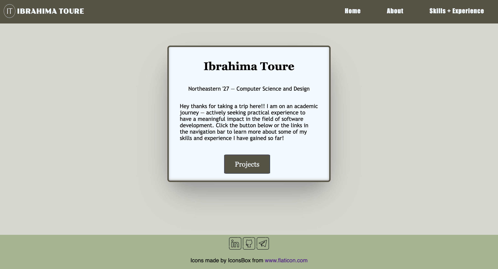

<h1 align="center">Ibrahima's Showcase – Who Are You?</h1>

Thanks for stopping by! I am Ibrahima, a rising sophomore at Northeastern 
University on an academic journey — actively seeking practical experience to have 
a meaningful impact in the field of software development through front-end 
development, UI/UX design, and software engineering.

  Introducing my W.A.Y. – a dynamic portfolio website showcasing who I am 
  as a person and a programmer. Using front-end development, I highlight my 
  achievements, interests in computer science, and fun facts like my favorite foods.
  Through HTML, CSS, and JavaScript, the site features multiple pages linked via 
  a navigation bar, offering insight into my personality, abilities, and accomplishments such as “About”,
  “Projects”, and “Skills + Experience”. With a clean, particular aesthetic and layout, my website provides
  users with a clear view of my skills and experiences. 

<a href="https://ibrahimast.github.io/IbrahimaST/" target="_blank">Explore my webpage for a glimpse into my world.</a>

